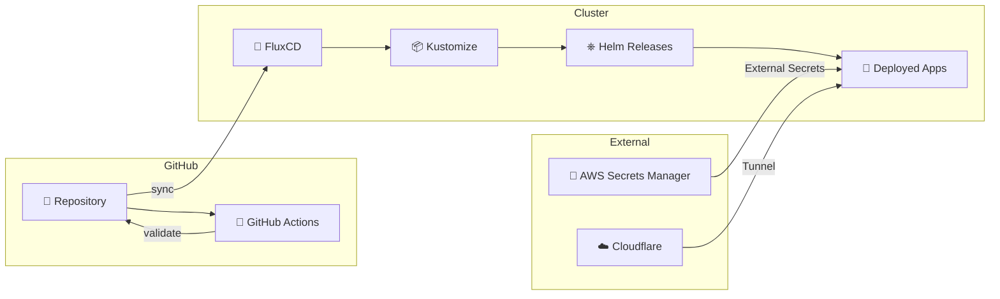

<div align="center">

# 🏠 Kube-Homelab

### Production-Grade Kubernetes on Bare Metal with kubeadm

[](https://github.com/heroaero-dev/kube-homelab/actions/workflows/ci.yaml)
[](https://kubernetes.io/)
[](https://fluxcd.io/)
[](https://renovatebot.com/)
[](LICENSE)

<br>


<br>

**A GitOps-driven, enterprise-patterned Kubernetes cluster built from scratch for learning, self-hosting, and CKA preparation.**

[Architecture](#-architecture) •
[Tech Stack](#-tech-stack) •
[Repository Structure](#-repository-structure) •
[Getting Started](#-getting-started) •
[Applications](#-deployed-applications) •
[Roadmap](#-roadmap)

</div>

---

## 📋 Overview

This repository contains the complete infrastructure-as-code for my homelab Kubernetes cluster, deployed using **kubeadm** on bare metal. It follows GitOps principles with FluxCD, implements enterprise patterns for secrets management, monitoring, and networking, while serving as a practical learning environment for Kubernetes administration.

### Why kubeadm?

> *"kubeadm gives me direct access to control plane mechanics, networking challenges, upgrade cycles, and the same patterns used in production clusters. It forces understanding instead of abstractions."*

Unlike managed Kubernetes or simplified distributions (k3s, microk8s), kubeadm exposes the full complexity of cluster operations—exactly what's needed for **CKA certification preparation** and real-world DevOps/SRE experience.

---

## 🏗 Architecture

### Cluster Topology

```
┌─────────────────────────────────────────────────────────────────────────────┐
│                              EXTERNAL ACCESS                                 │
│                                                                              │
│    Internet ──▶ Cloudflare Tunnel ──▶ Traefik Ingress ──▶ Services          │
│                                                                              │
└─────────────────────────────────────────────────────────────────────────────┘
                                       │
                                       ▼
┌─────────────────────────────────────────────────────────────────────────────┐
│                           KUBERNETES CLUSTER                                 │
│                                                                              │
│  ┌─────────────────────────────────────────────────────────────────────┐    │
│  │                     CONTROL PLANE (AMD Ryzen 9)                      │    │
│  │  ┌──────────┐ ┌──────────┐ ┌──────────┐ ┌──────────┐ ┌──────────┐   │    │
│  │  │ API      │ │ etcd     │ │ Scheduler│ │ CCM      │ │ Longhorn │   │    │
│  │  │ Server   │ │          │ │          │ │          │ │ Storage  │   │    │
│  │  └──────────┘ └──────────┘ └──────────┘ └──────────┘ └──────────┘   │    │
│  └─────────────────────────────────────────────────────────────────────┘    │
│                                                                              │
│  ┌────────────────────────────┐    ┌────────────────────────────────┐       │
│  │     WORKER NODE 1          │    │     WORKER NODE 2              │       │
│  │     (Raspberry Pi CM5)     │    │     (Raspberry Pi CM5)         │       │
│  │  ┌────────┐ ┌────────┐     │    │  ┌────────┐ ┌────────┐         │       │
│  │  │ Kubelet│ │ Cilium │     │    │  │ Kubelet│ │ Cilium │         │       │
│  │  └────────┘ └────────┘     │    │  └────────┘ └────────┘         │       │
│  └────────────────────────────┘    └────────────────────────────────┘       │
│                                                                              │
│  ┌─────────────────────────────────────────────────────────────────────┐    │
│  │                        NETWORKING (Cilium eBPF)                      │    │
│  │         MetalLB L2 Load Balancer  │  Traefik Ingress Controller     │    │
│  └─────────────────────────────────────────────────────────────────────┘    │
│                                                                              │
└─────────────────────────────────────────────────────────────────────────────┘
```

### Hardware Specifications

| Node | Role | Hardware | Specs |
|------|------|----------|-------|
| `control-plane` | Control Plane + Storage | AMD Ryzen 9 3900X | 12-core, RX5700XT 8GB, 1TB NVMe |
| `worker-01` | Worker | Raspberry Pi CM5 | 8GB RAM, 32GB eMMC |
| `worker-02` | Worker | Raspberry Pi CM5 | 8GB RAM, 32GB eMMC |

### GitOps Flow



---

## 🛠 Tech Stack

### Core Infrastructure

| Component | Technology | Purpose |
|-----------|------------|---------|
| **Cluster** | kubeadm | Bare-metal Kubernetes provisioning |
| **GitOps** | FluxCD v2 | Continuous delivery and reconciliation |
| **CNI** | Cilium | eBPF-powered networking, kube-proxy replacement |
| **Storage** | Longhorn | Distributed block storage with replication |
| **Load Balancer** | MetalLB | Bare-metal load balancer (L2 mode) |
| **Ingress** | Traefik | Kubernetes-native ingress controller |
| **Certificates** | cert-manager | Automated TLS with Let's Encrypt |
| **DNS/Tunnel** | Cloudflare | DNS management and secure tunneling |

### Security & Secrets

| Component | Technology | Purpose |
|-----------|------------|---------|
| **Secrets Backend** | AWS Secrets Manager | Centralized secret storage |
| **Secrets Operator** | External Secrets | Kubernetes secret synchronization |
| **Encryption** | SOPS + AGE | Git-native secret encryption |

### Observability

| Component | Technology | Purpose |
|-----------|------------|---------|
| **Metrics** | Prometheus | Time-series metrics collection |
| **Dashboards** | Grafana | Visualization and alerting |
| **Logs** | Fluent Bit → Victoria Logs | Log aggregation and retention |
| **Probes** | Blackbox Exporter | Endpoint monitoring (HTTP, TCP, ICMP) |
| **Alerting** | Alertmanager | Alert routing and notification |

### Automation

| Component | Technology | Purpose |
|-----------|------------|---------|
| **Dependency Updates** | Renovate | Automated version bumps |
| **Autoscaling** | KEDA | Event-driven pod autoscaling |
| **Config Reload** | Reloader | Automatic rollout on ConfigMap/Secret changes |

---

## 📁 Repository Structure

```
kube-homelab/
├── 📁 .github/
│   └── workflows/
│       └── ci.yaml              # Validation pipeline
│
├── 📁 apps/                      # Application manifests
│   ├── base/                     # Base configurations (Kustomize)
│   │   ├── homepage/             # Dashboard
│   │   ├── jellyfin/             # Media server
│   │   ├── linkding/             # Bookmark manager
│   │   ├── mealie/               # Recipe manager
│   │   ├── portainer/            # Container management
│   │   ├── postgresql/           # Database
│   │   └── podinfo/              # Demo application
│   │
│   └── staging/                  # Environment overlays
│       └── kustomization.yaml
│
├── 📁 clusters/                  # Cluster configurations
│   └── staging/
│       ├── flux-system/          # FluxCD bootstrap
│       ├── apps.yaml             # App Kustomization
│       ├── infrastructure.yaml   # Infra Kustomization
│       └── kustomization.yaml
│
├── 📁 infrastructure/            # Platform components
│   ├── configs/                  # Cluster-wide configs
│   │   ├── cluster-secret-store.yaml
│   │   └── clusterissuer.yaml
│   │
│   └── controllers/              # Helm-managed controllers
│       ├── cert-manager/
│       ├── cilium/
│       ├── cloudflare-tunnel/
│       ├── external-secrets/
│       ├── fluent-bit/
│       ├── keda/
│       ├── kube-prometheus-stack/
│       ├── longhorn/
│       ├── metallb/
│       ├── reloader/
│       ├── traefik/
│       └── victoria-logs/
│
├── 📁 .renovate/                 # Renovate configuration
├── 📄 .renovaterc.json5
└── 📄 README.md
```

### Design Principles

- **Kustomize bases** define reusable application templates
- **Overlays** customize per-environment (staging → prod → dev)
- **HelmRelease** CRDs manage Helm chart deployments via Flux
- **External Secrets** sync credentials from AWS without storing in Git
- **SOPS encryption** protects any secrets that must live in the repo

---

## 🚀 Deployed Applications

### Self-Hosted Services

| Application | Description |
|-------------|-------------|
| **Homepage** | Unified dashboard for all services |
| **Jellyfin** | Media streaming server |
| **Mealie** | Recipe management |
| **Linkding** | Bookmark manager |
| **Portainer** | Container management UI |
| **Vaultwarden** | Password manager (Bitwarden-compatible) |

### Platform Services

| Service | Description |
|---------|-------------|
| **Grafana** | Metrics dashboards |
| **Longhorn UI** | Storage management |
| **Traefik Dashboard** | Ingress monitoring |

---

## 🔧 Getting Started

### Prerequisites

- Linux machine(s) with `kubeadm`, `kubelet`, `kubectl` installed
- Cilium CLI
- Flux CLI
- SOPS + AGE for secret decryption
- GitHub account with SSH key configured

### Bootstrap the Cluster

```bash
# 1. Initialize control plane (adjust CIDR as needed)
sudo kubeadm init --pod-network-cidr=10.244.0.0/16 --skip-phases=addon/kube-proxy

# 2. Install Cilium CNI
cilium install --set kubeProxyReplacement=true

# 3. Bootstrap FluxCD
flux bootstrap github \
  --owner=<your-github-username> \
  --repository=kube-homelab \
  --branch=main \
  --path=clusters/staging \
  --personal

# 4. Create SOPS secret for decryption
kubectl create secret generic sops-age \
  --namespace=flux-system \
  --from-file=age.agekey=/path/to/age.key
```

### Verify Deployment

```bash
# Check Flux reconciliation
flux get all -A

# Watch HelmReleases
kubectl get helmreleases -A -w

# Check application pods
kubectl get pods -n staging
```

---

## 🗺 Roadmap

### Current State: Single Environment (Staging)

### Planned Improvements

- [ ] **Multi-tenant structure** — Separate `prod`, `staging`, `dev` environments
- [ ] **HA Control Plane** — Add additional control plane nodes
- [ ] **Velero backups** — Cluster and PV backup/restore
- [ ] **Network policies** — Cilium-based workload isolation
- [ ] **Service mesh** — Evaluate Cilium Service Mesh or Linkerd
- [ ] **GPU workloads** — Leverage RX5700XT for ML/transcoding
- [ ] **Ansible automation** — Node provisioning and kubeadm config

---

## 📚 Learning Resources

This cluster serves as a practical learning environment for:

- **CKA Certification** — Real cluster administration experience
- **GitOps Practices** — FluxCD, Kustomize, Helm integration
- **Cloud-Native Patterns** — Secrets management, observability, autoscaling
- **Bare-Metal Challenges** — Networking, storage, load balancing without cloud providers

---

## 🤝 Contributing

Contributions, suggestions, and feedback are welcome! Feel free to:

1. Open an issue for bugs or feature requests
2. Submit a PR for improvements
3. Star the repo if you find it useful

---

## 📄 License

This project is licensed under the MIT License - see the [LICENSE](LICENSE) file for details.

---

<div align="center">

**Built with mass mass amounts of mass `kubectl get pods` commands**

</div>
